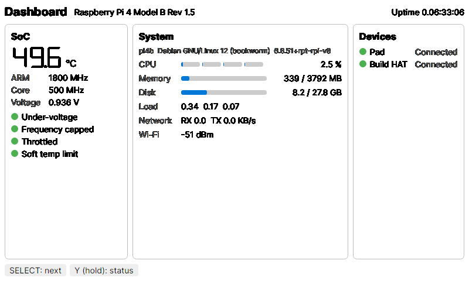
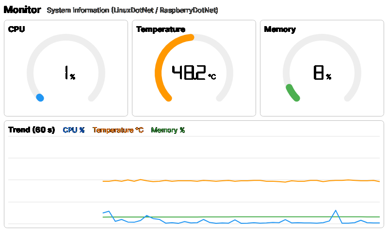
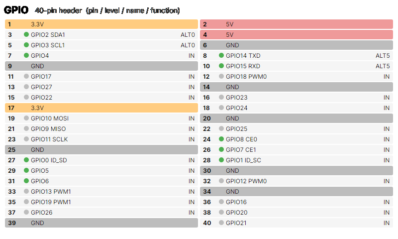
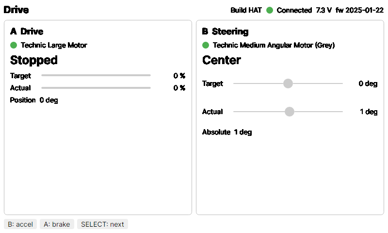
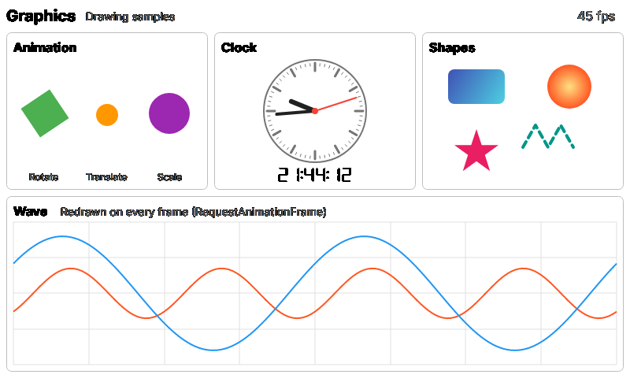
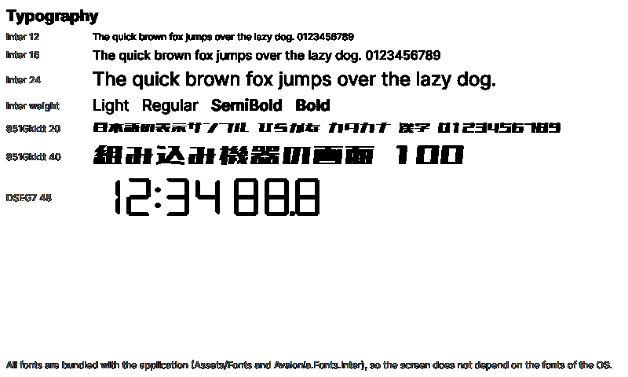
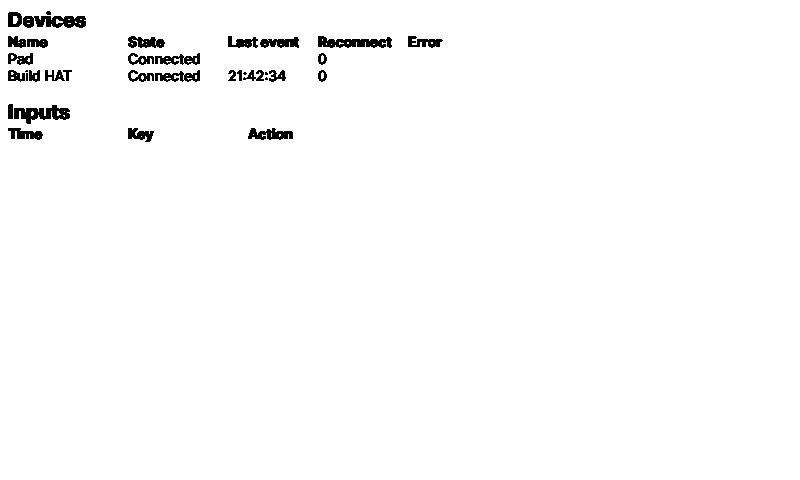

# template-avalonia-embedded

Raspberry Pi の組み込み機器向けの Avalonia アプリの雛形。DRM(LinuxFramebuffer)で全画面に描き、ゲームパッドや GPIO のボタンで操作する。

## 🖥️ 画面

Raspberry Pi 4(800 × 480)に Build HAT とゲームパッドをつないで動かした画面。Xbox 配列のパッドでは、BACK(SELECT)で Dashboard → Monitor → GPIO → Drive → Graphics → Typography と切り替わり、Y を長押しすると状態画面が開く。Drive 画面では B で加速、A でブレーキ、十字キーの左右でハンドルを切る。

| Dashboard | Monitor |
| --- | --- |
|  |  |
| SoC の温度・クロック・電圧・スロットリング、CPU・メモリー・ディスク・ネットワーク・Wi-Fi、デバイスの状態(RaspberryDotNet.SystemInfo・LinuxDotNet.SystemInfo) | CPU・温度・メモリーのゲージと 60 秒のトレンド |
| **GPIO** | **Drive** |
|  |  |
| 40 ピンのヘッダーの各ピンの機能とレベル | Build HAT の走行の見本(A = 速度・B = ステアリング。RaspberryDotNet.BuildHat) |
| **Graphics** | **Typography** |
|  |  |
| 描画サンプル(アニメーション・アナログ時計・図形・毎フレーム描く波形・fps) | 同梱のフォントの見本(Inter・851Gkktt・DSEG7) |
| **状態画面** | |
|  | |
| デバイスの一覧と直近の入力 | |
