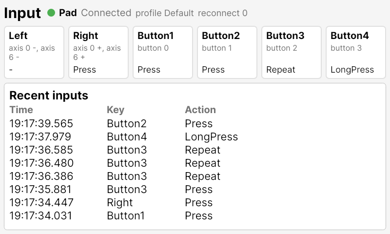

# template-avalonia-embedded

Raspberry Pi の組み込み機器向けの Avalonia アプリの雛形。

## 🖥️ 画面

- SoC の温度・クロック・電圧・スロットリング
- CPU・メモリー・ディスク・ネットワーク・Wi-Fi、デバイスの状態

- CPU・温度・メモリーのゲージと 60 秒のトレンド

- 40 ピンのヘッダーの各ピンの機能とレベル、20 ピンずつページ切り替え

- パッドの接続状態と、キーごとの押下・割り当て・最後の動作
- 直近の入力(押下・長押し・リピート)

- Build HAT による速度とステアリング

- アニメーション・アナログ時計・図形・毎フレーム描く波形・fps

- 各種フォント、絵文字
